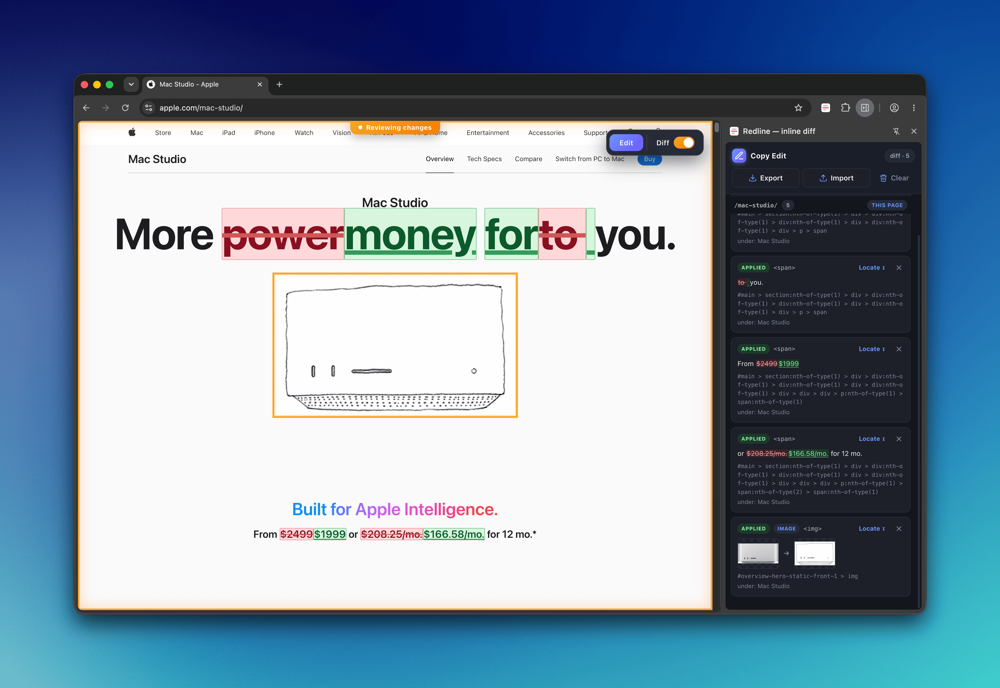

  

<h1 align="center">Redline</h1>

A Chrome extension that lets a content editor fix a web page's copy and images directly in the browser from a side panel, then export the edits as a machine-readable changeset (a `.redline-bundle.zip`) that a developer or coding agent can re-apply and trace back to the source. No backend, no AI — nothing leaves the browser.

## Screenshot

